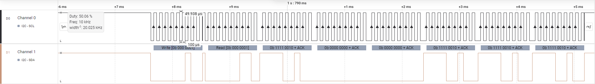

<h2 align="center">
    STM32Cube IDE - TM1637
</h2>

STM32Cube IDE library for TM1637 (LED Driver)

#### Description

***
The library is base on **Update Interrupt Event** of TIMER to create the SCLK frequency, in each Update Interrupt the *SCLK* signal toggle and change the state of *SDIO* pin to send the DATA according to the communication mhetod.
Microprocessor data realize the communication with **TM1637** by means of two–wire bus interface (*Note: The communication method is not equal to I2C bus protocol totally because there is no slave address*). 
When data is input, DIO signal should not change for high level CLK and DIO signal should change for low level CLK signal. When CLK is a high level and DIO changes from high to low level, data input starts. When CLK is a high level and DIO changes  from low level to high level, data input ends.

There are an example project for the next devices:
1. [STM32F103C6T6](https://github.com/dm2142/STM32/tree/main/TM1637/STM32F103C6T6_TM1637)
2. [STM32F446RE](https://github.com/dm2142/STM32/tree/main/TM1637/STM32f446RE_TM1637)
3. [STM32FH723ZGT6](https://github.com/dm2142/STM32/tree/main/TM1637/STM32H723ZGT7_TM1637)

<p align="center">
  
</p>

#### Usage

***

1. Include the source file [tm1637.c](https://github.com/dm2142/STM32/blob/main/TM1637/tm1637.c) and header file [tm1637.h](https://github.com/dm2142/STM32/blob/main/TM1637/tm1637.h) in your project.

```c

#include "main.h"
#include <tm1637.h>
```


2. Use the struct **TIM1637_Handle_t** to configure the initial parameter for TM1637, as ***SCLK***, ***SDIO*** pin, ***CLK*** frequency and the level of brightness.

    - **tim1637_dev.Timer.Instance**: Set the base address of the timer to use (Preference a Basic Timer) the Update Interrupt event.
    - **tim1637_dev.SCLK_Freq**: Specifie the CLK frequency to configure the TIMER.  

```c

TIM1637_Handle_t tim1637_dev = {0};

int main(void){

  tim1637_dev.SCLK_pin = GPIO_PIN_6;
  tim1637_dev.SCLK_gpio = GPIOA;
  tim1637_dev.SDIO_pin = GPIO_PIN_5;
  tim1637_dev.SDIO_gpio = GPIOA;
  tim1637_dev.Timer.Instance = TIM3;
  tim1637_dev.SCLK_Freq = 10000;

  tim1637_dev.Brightness = PulseWidth_14_16;
  tim1637_dev.DispCtrl = TIM1637_DISPLAY_ON;
  tim1637_Init(&tim1637_dev);

}
```

3. Calls Init method **tim1637_Init(&tim1637_dev)** to configure the GPIO peripherals, configure the TIMER selected and enable *IRQ* for the timer.

```c

int main(void){

  tim1637_Init(&tim1637_dev);

}
```

4. Add in **stm32xxxx_it.c** the IRQ method related with the selected TIMER and include the .

```c

/* USER CODE BEGIN 1 */
void TIM3_IRQHandler(void){
	extern TIM1637_Handle_t tim1637_dev;
	tim1637_Callback(&tim1637_dev);
}

/* USER CODE END 1 */
```

Finally, the example of configuration show next.
```c

#include "main.h"
#include <tm1637.h>

TIM1637_Handle_t tim1637_dev = {0};

int main(void){

  HAL_Init();
  SystemClock_Config();

  tim1637_dev.SCLK_pin = GPIO_PIN_6;
  tim1637_dev.SCLK_gpio = GPIOA;
  tim1637_dev.SDIO_pin = GPIO_PIN_5;
  tim1637_dev.SDIO_gpio = GPIOA;
  tim1637_dev.Timer.Instance = TIM3;
  tim1637_dev.SCLK_Freq = 10000;

  tim1637_dev.Brightness = PulseWidth_14_16;
  tim1637_dev.DispCtrl = TIM1637_DISPLAY_ON;
  tim1637_Init(&tim1637_dev);

  while (1)
  {
	  tim1637_Demo(&tim1637_dev);
  }

}
```

#### Methods

***
```c
/**
  * @brief  Send 0 value to turn off all the segments in each display.
  * @param  TIM1637_Handle_t* tim1637
  */
void tim1637_ClearAll( TIM1637_Handle_t* tim1637 );

/**
  * @brief  Send the specific value ( to set the 8 segments ) in an specific display.
  * @param 	DisplayAddr specifies the display to set the value.
  * @param  Value represents the state of the 8 segments in the display, where LSB represents the A-Segment and MSB represents the dot-segment.
  */
void tim1637_SetValue( TIM1637_Handle_t* tim1637, uint8_t DisplayAddr, uint8_t Value );

/**
  * @brief	Use to represent an Integer Number in the displays.
  */
void tim1637_SetIntNumber( TIM1637_Handle_t* tim1637, uint32_t Number );

/**
  * @brief	Use to represent a double or float value in the displays.
  * @param double Number
  * @param uint8_t NumDecimals represent the number of digits to use after of decimal point. Maximun of 3.
  */
void tim1637_SetFloatNumber( TIM1637_Handle_t* tim1637, double Number, uint8_t NumDecimals );


void tim1637_TurnOn( TIM1637_Handle_t* tim1637 );


void tim1637_TurnOff( TIM1637_Handle_t* tim1637 );

void tim1637_SetBrightness( TIM1637_Handle_t* tim1637, TIM1637_PulseWidth_e Brightness );

```

In the next image show the Clock frequency of *10 kHz* as configurated in the struct.

<p align="center">
  
</p>