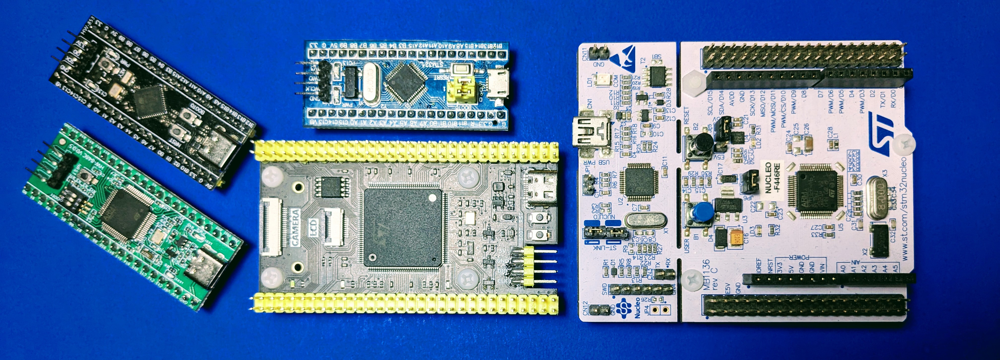

  

<h2 align="center">
    STM32 - Drivers / Projects / Templates
</h2>

#### Description

***
The repository is intented to store multiple libraries for some devices (temperature sensors, accelerometer and gyroscope, DAC device, etc), also included templates projects for FreeRTOS, QM (Finite State Machines) and CMSIS-DSP.

The projects are created using [STM32Cube IDE](https://www.st.com/en/development-tools/stm32cubeide.html), mostly of the source projects in the repository runs in the next devices:

- [STM32F103C8/C6](https://www.st.com/en/microcontrollers-microprocessors/stm32f103c8.html)
- [STM32F401RC](https://www.st.com/en/microcontrollers-microprocessors/stm32f401rc.html)
- [STM32F411CE](https://www.st.com/en/microcontrollers-microprocessors/stm32f411ce.html)
- [STM32F446RE](https://www.st.com/en/microcontrollers-microprocessors/stm32f446re.html)
- [STM32FH723ZGT6](https://www.st.com/en/microcontrollers-microprocessors/stm32h723zg.html)

***
#### Drivers

- [mcp4725]() : 12-Bit Digital-to-Analog Converter with EEPROM Memory.
- [tm1637]() : TM1637 is a kind of LED (light-emitting diode display) drive control special circuit with keyboard scan interface and it's internally integrated with MCU digital interface

***
#### Templates

- FreeRTOS
- QM
- CMSIS-DSP

***
#### Projects

